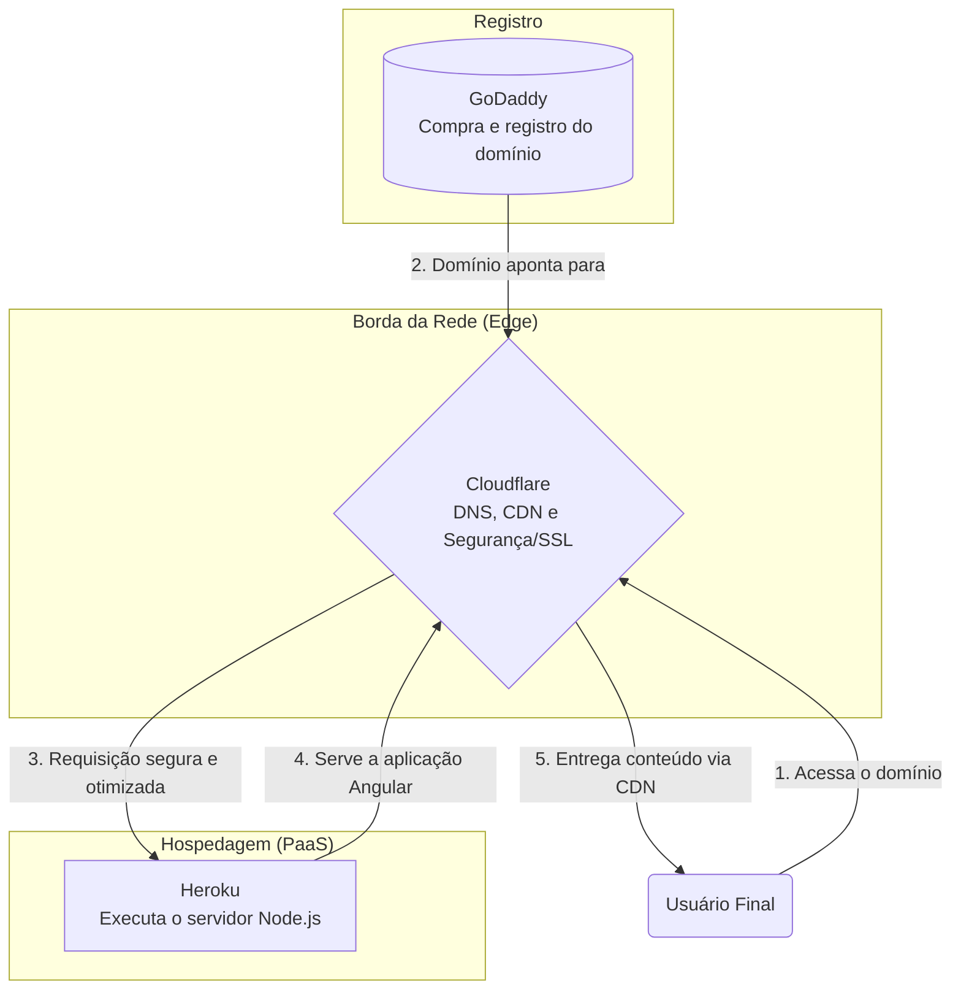

```mermaid
graph TD;
    subgraph "Registro";
        GoDaddy[("GoDaddy<br>Compra e registro do domínio")];
    end

    subgraph "Borda da Rede (Edge)";
        Cloudflare{"Cloudflare<br>DNS, CDN e Segurança/SSL"};
    end

    subgraph "Hospedagem (PaaS)";
        Heroku["Heroku<br>Executa o servidor Node.js"];
    end

    User(Usuário Final) -->|1. Acessa o domínio| Cloudflare;
    GoDaddy -- "2. Domínio aponta para" --> Cloudflare;
    Cloudflare -->|3. Requisição segura e otimizada| Heroku;
    Heroku -->|4. Serve a aplicação Angular| Cloudflare;
    Cloudflare -->|5. Entrega conteúdo via CDN| User;
```
