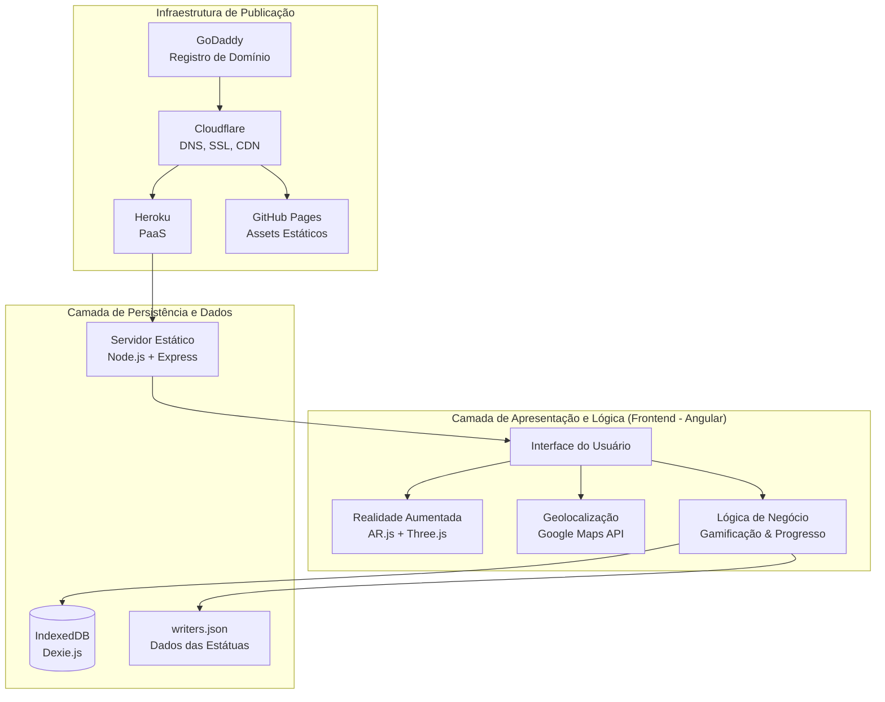
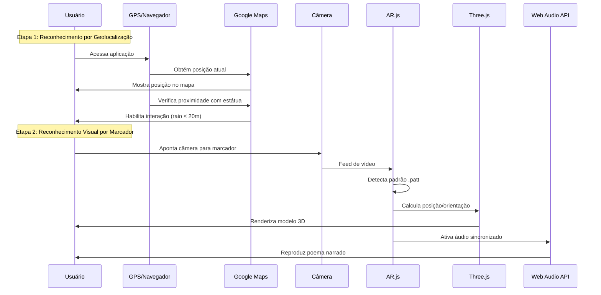
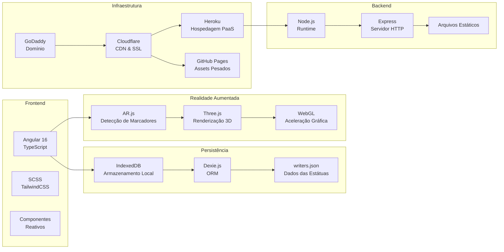
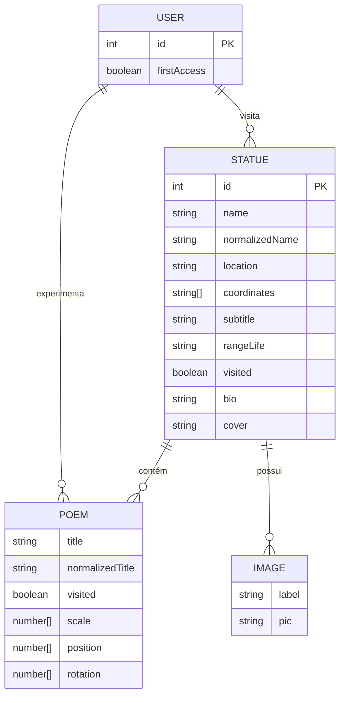
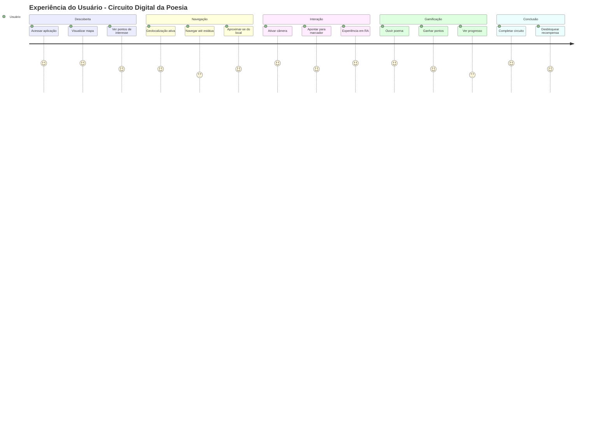
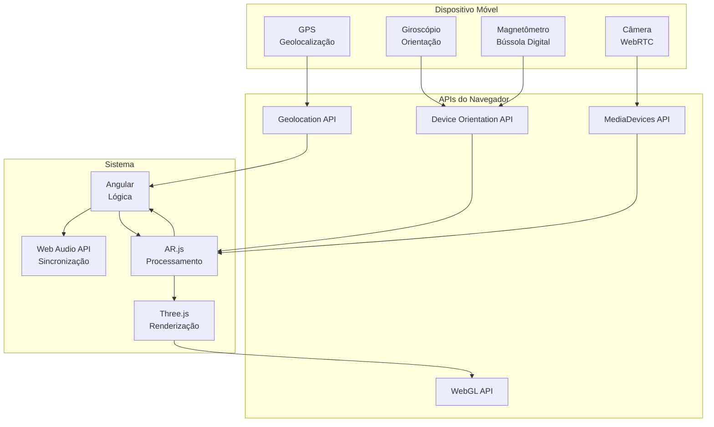

# Diagramas de Arquitetura - Circuito Digital da Poesia

## 1. Arquitetura Geral do Sistema

## 2. Fluxo de Ativação da Realidade Aumentada

## 3. Stack Tecnológica e Infraestrutura

## 4. Estrutura de Dados

## 5. Fluxo de Experiência do Usuário

## 9. Integração de Sensores e APIs

## Legenda dos Diagramas

### Símbolos Utilizados:

- **Retângulos**: Componentes/Entidades
- **Círculos**: Pontos de decisão/processamento
- **Losangos**: Condições/verificações
- **Setas**: Fluxo de dados/controle
- **Subgraphs**: Agrupamentos lógicos

### Cores e Estilos:

- **Azul**: Componentes frontend
- **Verde**: Componentes backend/infraestrutura
- **Laranja**: APIs e serviços externos
- **Roxo**: Dados e persistência
- **Cinza**: Infraestrutura de rede

### Notas Técnicas:

- Todos os diagramas seguem padrões UML e Mermaid
- As relações mostram dependências reais do sistema
- Os fluxos representam o comportamento descrito na tese
- A arquitetura reflete o estado atual do MVP
