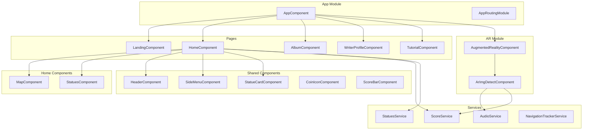
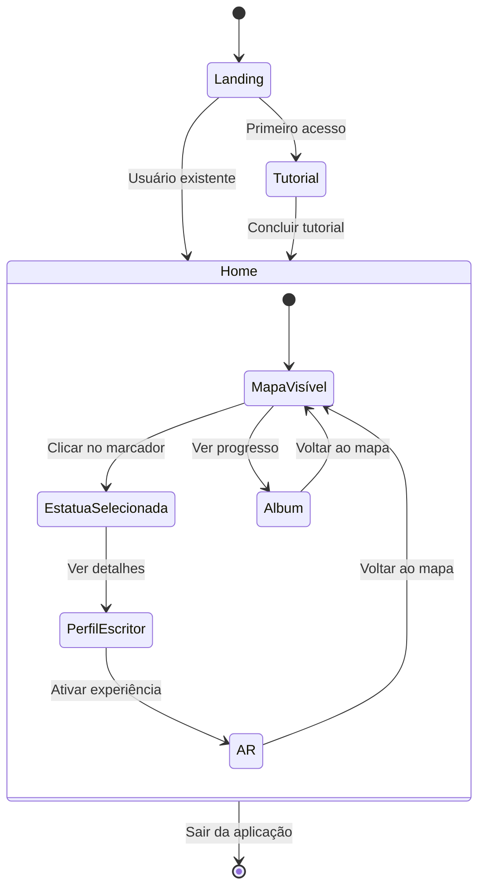
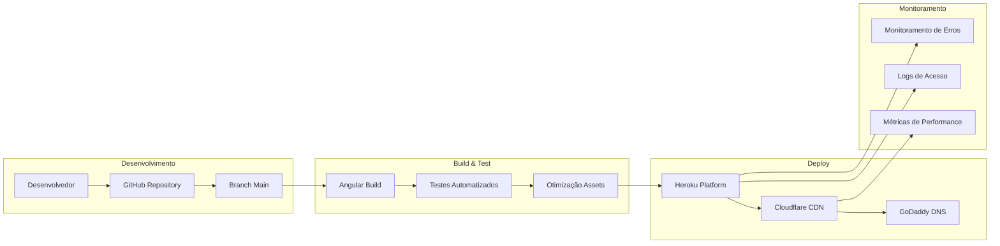
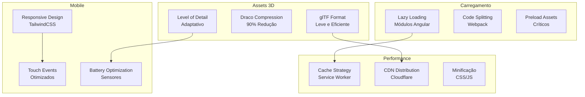
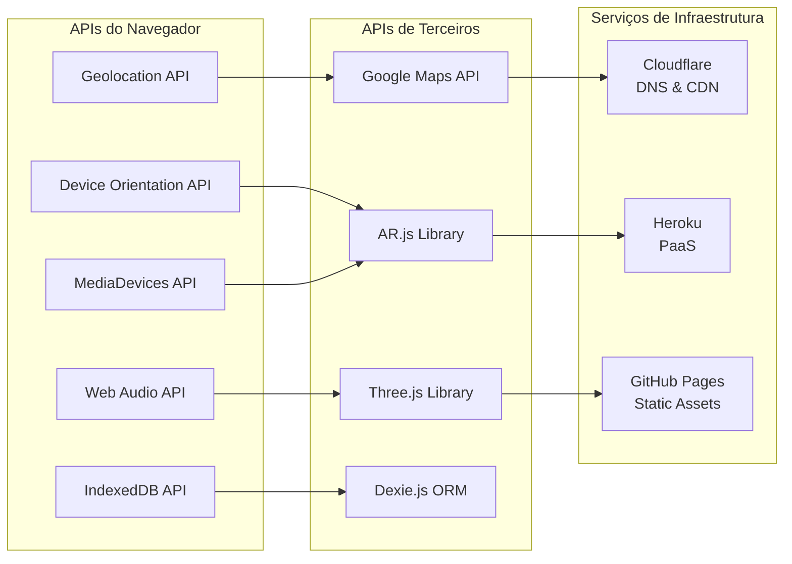
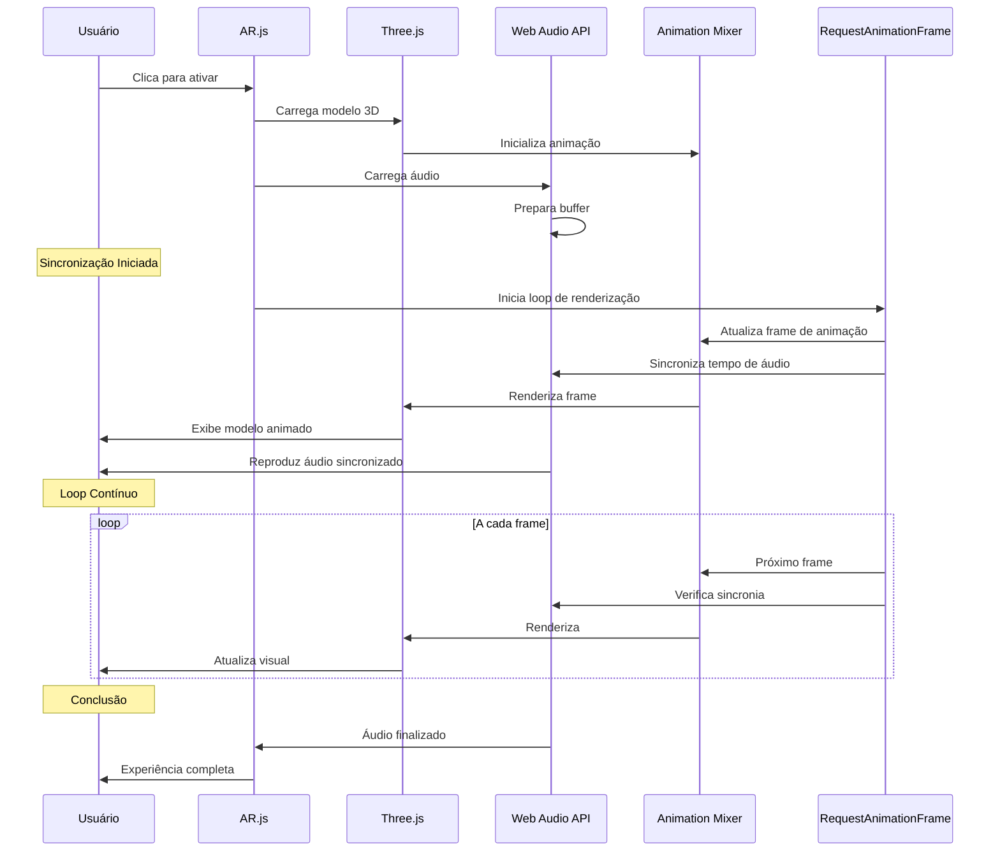

# Diagramas Detalhados - Complementares

## Arquitetura de Componentes Angular



## Fluxo de Dados e Estado



## Pipeline de Deploy e CI/CD



## Estratégias de Otimização



## Integração de APIs Externas



## Modelo de Dados Detalhado

```mermaid
classDiagram
    class Statue {
        +int id
        +string name
        +string normalizedName
        +string location
        +string[] coordinates
        +string subtitle
        +string rangeLife
        +boolean visited
        +string bio
        +string cover
        +Poem[] poems
        +Image[] images
        +getDistanceFromUser()
        +markAsVisited()
    }

    class Poem {
        +string title
        +string normalizedTitle
        +boolean visited
        +number[] scale
        +number[] position
        +number[] rotation
        +string audioUrl
        +string model3DUrl
        +playAudio()
        +loadModel3D()
    }

    class User {
        +int id
        +boolean firstAccess
        +int totalScore
        +Date lastAccess
        +Statue[] visitedStatues
        +Poem[] experiencedPoems
        +updateScore()
        +markFirstAccess()
    }

    class Image {
        +string label
        +string pic
        +string alt
        +string description
    }

    class ScoreService {
        +int currentScore
        +addPoints(points)
        +getTotalScore()
        +saveToIndexedDB()
    }

    class StatuesService {
        +Statue[] getAllStatues()
        +Statue getStatueById(id)
        +Statue[] getNearbyStatues(location)
        +updateStatueData(id, data)
    }

    Statue ||--o{ Poem : contains
    Statue ||--o{ Image : has
    User ||--o{ Statue : visits
    User ||--o{ Poem : experiences
    ScoreService --> User : manages
    StatuesService --> Statue : manages
```

## Fluxo de Sincronização Áudio-Visual



## Notas de Implementação

### Características dos Diagramas:

1. **Arquitetura Geral**: Mostra a separação clara entre frontend, backend e infraestrutura
2. **Fluxo de RA**: Detalha o processo em duas etapas conforme descrito na tese
3. **Stack Tecnológica**: Organiza as tecnologias por responsabilidade
4. **Estrutura de Dados**: Representa o modelo de dados real implementado
5. **Experiência do Usuário**: Mapeia a jornada completa do usuário
6. **Integração de Sensores**: Mostra como os sensores se conectam ao sistema

### Benefícios para a Tese:

- **Clareza Visual**: Facilita a compreensão de conceitos complexos
- **Documentação Técnica**: Serve como referência para implementações futuras
- **Comunicação**: Ajuda a explicar o sistema para diferentes audiências
- **Validação**: Confirma a coerência entre descrição textual e implementação
- **Evolução**: Base para planejamento de melhorias e escalabilidade
